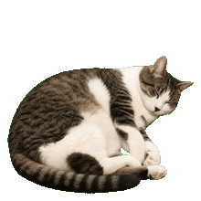

# DesktopCat

A native macOS desktop pet featuring Julie-LaoTai, with a local to-do list and Pomodoro timer.



## Features

- A transparent, always-on-top desktop cat that rests and occasionally walks
- Drag to move, scroll to resize, click for a belly rub, and double-click to wave
- Persistent to-do list
- 25/5 Pomodoro timer with pause, reset, sound, and restored progress
- Attached productivity panel and complete menu-bar user menu
- Local-only storage with no analytics, accounts, or network access

## Download

Download `DesktopCat.zip` from this repository's Releases page. Unzip it, move `DesktopCat.app` to Applications, and double-click to launch.

If macOS blocks the first launch, right-click `DesktopCat.app` and choose **Open**.

Requires macOS 13 or later on Apple Silicon.

## User manual

Read the bilingual [DesktopCat User Guide](USER_GUIDE.md) for complete installation, controls, productivity tools, menus, and troubleshooting.

## Build from source

Install the Xcode Command Line Tools, then run:

```bash
./scripts/build-app.sh
```

The ad-hoc signed application is written to `dist/DesktopCat.app`.

## Privacy

Tasks, timer state, window position, and pet size are stored in macOS `UserDefaults`. DesktopCat does not send data anywhere.
